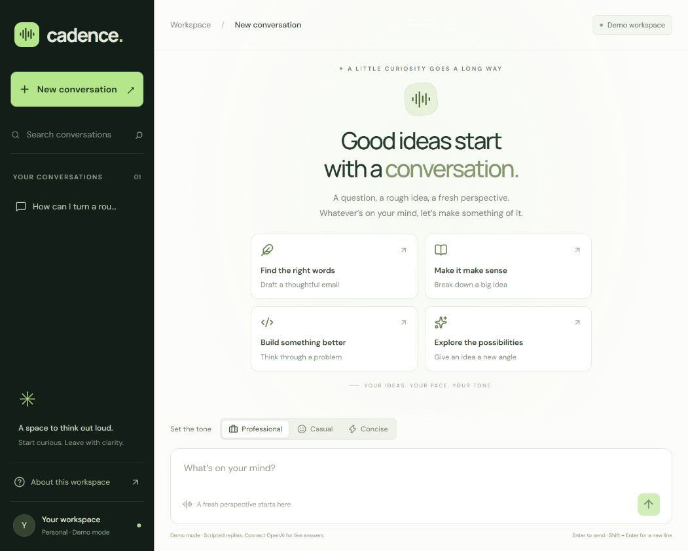
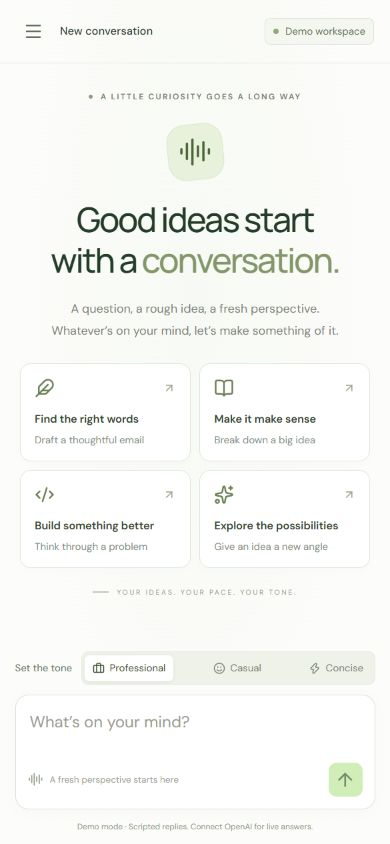
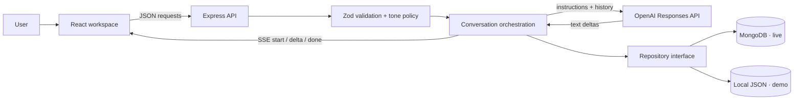

<div align="center">


# Cadence

### Your ideas. Your pace. Your tone.

A thoughtfully designed AI chat workspace with real streaming, persistent conversations, and a voice that adapts to you.

[](https://github.com/anannyay/quantiphi_chat_assistant2/actions/workflows/ci.yml)


[Quick start](#quick-start) · [Architecture](docs/ARCHITECTURE.md) · [API contract](docs/API.md) · [Viva guide](docs/VIVA.md)

</div>



<details>
<summary>See the mobile experience</summary>



</details>

## What it does

- **Streams answers as they arrive** from OpenAI, with a cancel button that also aborts the upstream request.
- **Changes tone on the server:** Professional, Casual, and Concise map to allowlisted system instructions on every request.
- **Remembers conversations** in MongoDB, including prompts, responses, tone, timestamps, and completion status.
- **Makes history useful:** search, reopen, delete with confirmation, copy responses, and export a conversation as Markdown.
- **Handles the unhappy path:** input limits, duplicate generation protection, incomplete-response labels, network errors, and crash recovery.
- **Runs without secrets in demo mode.** Demo responses are visibly labeled scripted examples; live mode never silently falls back to fake AI.

## Quick start

Requires **Node.js 22.12+** and npm.

```bash
git clone https://github.com/anannyay/quantiphi_chat_assistant2.git
cd quantiphi_chat_assistant2
npm ci
npm run dev
```

Open **http://127.0.0.1:5173**. The default mode uses scripted streaming replies and a local JSON file, so the UI can be reviewed immediately without API billing or database setup.

### Enable real AI and MongoDB

1. Copy `.env.example` to `.env` (`Copy-Item .env.example .env` in PowerShell, or `cp .env.example .env` on macOS/Linux).
2. Fill in:

   ```dotenv
   APP_MODE=live
   OPENAI_API_KEY=your-key-here
   OPENAI_MODEL=gpt-4.1-mini
   MONGODB_URI=mongodb://127.0.0.1:27017
   MONGODB_DB=cadence
   ```

3. Start local MongoDB with `docker compose up -d` or use a MongoDB Atlas URI. For Atlas, configure a database user and allow your machine's IP in Network Access.
4. Restart the server. The header should read **Live AI**, and About this workspace should show **MongoDB**.

The model is configurable because access varies by OpenAI account. Use a Responses-compatible model available to your account. Never put a key in a `VITE_` variable or commit `.env`.

### Production build, locally

```bash
npm run build
npm start
```

Open **http://127.0.0.1:3001**. Express serves both the compiled UI and API. No separate frontend hosting or CORS configuration is needed. The server binds to loopback by default.

> This is a single-user assessment application. It does not implement accounts or tenant isolation. Add authentication and ownership checks before exposing a live instance to other users.

## Architecture at a glance



The UI manages presentation and interactions. Validation, tone instructions, context selection, provider calls, timestamps, and persistence happen on the server. The provider and repository are injected into the app, making failure cases testable without real API calls.

## Repository map

```text
src/
  App.jsx                 Workspace state, interactions, layout
  components/Message.jsx  Safe Markdown rendering and response actions
  api.js                  JSON client and incremental SSE decoder
  styles.css              Responsive visual system
server/
  app.js                  HTTP boundary and streaming orchestration
  domain.js               Validation, tone policies, context window
  provider.js             OpenAI and explicitly scripted demo adapters
  repository.js           MongoDB and atomic JSON persistence adapters
  index.js                Configuration, startup, recovery, shutdown
tests/
  api.test.js             API, persistence, failure and concurrency tests
  domain.test.js          Policy, validation, fragmented UTF-8/SSE tests
  integration/            Real MongoDB adapter integration test
docs/
  ARCHITECTURE.md          Diagrams, data model, decisions, tradeoffs
  API.md                  Endpoints, examples, stream event contract
  VIVA.md                 Walkthrough and implementation questions
  TESTING.md              Verification commands and manual scenarios
```

## Verification

```bash
npm run check         # Unit/API tests and production build
npm run test:mongo    # Real MongoDB integration test; requires MongoDB
npm run format:check  # Consistent source and documentation formatting
```

GitHub Actions runs all three with an isolated MongoDB service. Tests use disposable records and stubbed AI responses, so they do not consume OpenAI credits. Live OpenAI verification requires your own credentials; mocked provider tests are not a claim of a successful paid API call.

## Two-minute demo

1. Send the same question with **Professional**, then **Concise**, in a new conversation for each.
2. Show the stored tone badge on each answer and explain the backend instruction mapping.
3. Start another answer and press **Stop**; show the interrupted state.
4. Reload, reopen the thread from history, and export it as Markdown.
5. Open the architecture diagram and show `instructionsFor()` and the `done`-after-save ordering.

See [VIVA.md](docs/VIVA.md) for the reasoning behind these choices, and [TESTING.md](docs/TESTING.md) for edge cases and remaining limitations.

## Design decisions

| Choice                          | Why                                                                                                             |
| ------------------------------- | --------------------------------------------------------------------------------------------------------------- |
| SSE over a POST fetch           | Streaming is one-way; fetch supports a request body and AbortController without a WebSocket service.            |
| Server-owned tone allowlist     | The client sends a tone name, never arbitrary system instructions.                                              |
| MongoDB conversation document   | Messages and their metadata can be read together and updated atomically per document.                           |
| Save before `done`              | The interface only treats a response as complete after persistence succeeds.                                    |
| Explicit demo mode              | Evaluators can try the interaction immediately; missing live credentials never produce misleading fake answers. |
| React Markdown without raw HTML | Useful formatting without executing HTML returned by a model. Remote images are disabled.                       |

Built with AI assistance for the NMIMS / Quantiphi vibe-coding brief. Implementation choices and limitations are documented so the code can be explained and extended.

### References

- [OpenAI streaming responses](https://developers.openai.com/api/docs/guides/streaming-responses)
- [MongoDB Node.js driver](https://www.mongodb.com/docs/drivers/node/current/)
- [React Markdown security](https://github.com/remarkjs/react-markdown#security)
