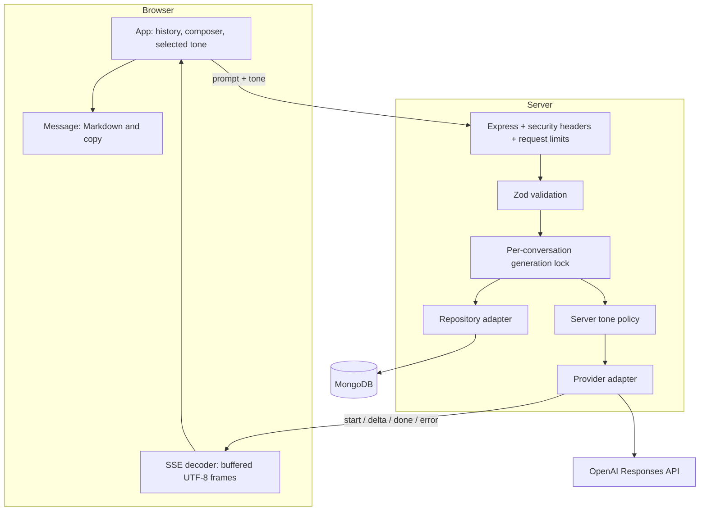
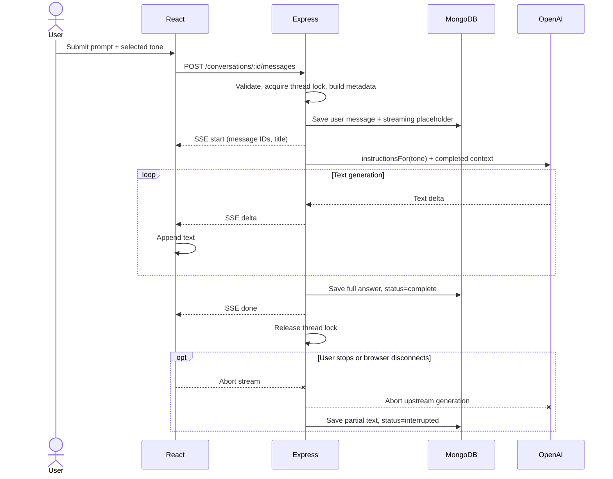
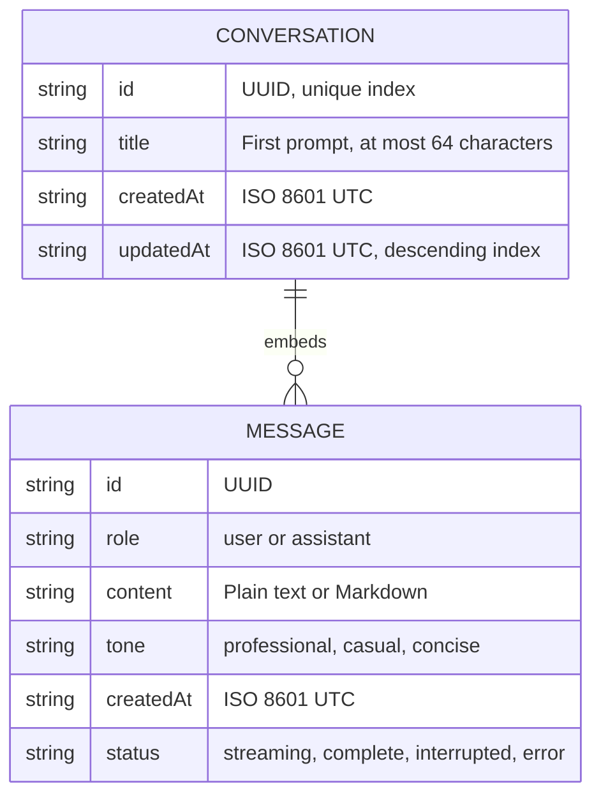

# Architecture

Cadence is a single-user, single-process chat application. The browser owns presentation; the server owns policy and data. Dependencies flow inward toward small domain functions and adapter contracts.

## Components

## One request, end to end

The cancellation branch can occur during generation. It is shown separately to keep the happy path readable.

## Data model

An embedded array keeps conversation retrieval simple. Summaries exclude message bodies and include `messageCount`. The app caps each thread at 200 messages and each user prompt at 8,000 characters. The AI receives the most recent 24 complete messages; older messages remain visible in history but are outside its context window.

## Boundaries and invariants

1. **Tone is server-owned.** Zod rejects unknown values and extra body fields. `instructionsFor()` maps the selected value into the Responses API's system/developer instruction field on every request. Prior messages do not set the current tone.
2. **Credentials stay on the server.** The frontend only calls same-origin `/api` endpoints. `.env` is ignored and no secret is injected into the Vite build.
3. **One generation per thread.** An in-process Set rejects simultaneous writes with 409. Different threads can generate independently. Deleting an actively generating conversation is also rejected.
4. **Completed means saved.** The user prompt is stored before provider invocation; final text is stored before the `done` event.
5. **Failures remain visible.** Partial answers are stored as `error` or `interrupted`; they are excluded from future model context. Their user prompts remain in context.
6. **Live failures never become demo replies.** Live startup fails if configuration or MongoDB is unavailable. Provider failures produce an explicit error frame.
7. **Streams are not network packets.** The browser's incremental TextDecoder and frame buffer handle split JSON, newlines, and multi-byte characters.

## Adapter contracts

`Repository`: `init`, `list`, `get(id)`, `save(record)`, `delete(id)`, `close`.

`Provider`: `stream(messages, tone, signal)` returns an async iterator of text deltas. The OpenAI implementation requires a terminal completion event; a truncated response is an error. Demo mode provides deterministic, visibly labeled examples using the same transport.

The JSON adapter serializes writes and renames a temporary file atomically. It is for local demos, not shared production storage. MongoDB uses a unique ID index and a descending update-time index.

## Explicit tradeoffs and next steps

| Current decision                     | Limit                                                   | Production evolution                                   |
| ------------------------------------ | ------------------------------------------------------- | ------------------------------------------------------ |
| Single-user workspace                | All visitors to one instance share history              | Add identity, ownership queries, authorization tests   |
| In-process thread lock               | Multiple server replicas could overwrite a document     | Add distributed leases or optimistic revision checks   |
| Embedded messages                    | Very long threads grow documents                        | Separate message collection, pagination, retention     |
| Last 24 complete messages            | Older information can be forgotten                      | Token-budgeted context and summaries                   |
| Save at start and end                | Abrupt process death loses unsaved partial text         | Periodic checkpoints or append-only stream persistence |
| Startup recovery                     | Interrupted placeholders recovered on restart           | Worker reconciliation and lease expiry                 |
| SSE without resume IDs               | A lost connection cannot replay missed deltas           | Sequence IDs and resumable event storage               |
| No retry button                      | User can resend, but a failed prompt remains in history | Idempotency keys and explicit retry semantics          |
| Browser text follows provider chunks | Chunk sizes vary by provider                            | Optional presentation-only typewriter queue            |

The design deliberately avoids claiming production readiness beyond these boundaries.
